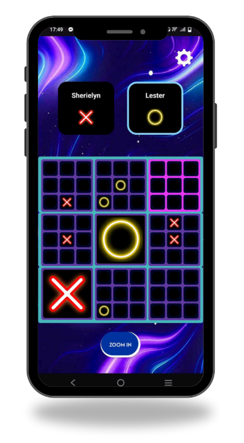

# 📱 Ultimate Tic-Tac-Toe

  

## 📖 Overview

**Ultimate Tic-Tac-Toe** is an exciting and strategic twist on the classic game, designed as a dynamic mobile application. 

Unlike the traditional 3x3 game, this app features a massive 9x9 grid made up of nine smaller 3x3 Tic Tac Toe boards. The core strategy revolves around a dynamic mechanic where each move directs the opponent to a specific small board, based on the previous move's position. With its intuitive controls, engaging design, and competitive nature, Ultimate Tic-Tac-Toe provides a fresh and fun experience for players of all ages.

---

## 🚀 Key Features

The application is built with a focus on both robust backend systems and engaging game logic.

### 👤 General System Features

* **User Registration & Login:** Allows new users to create an account with robust data validation. Secure authentication verifies account details to grant access.
* **Secure Passwords:** Registration requires passwords to meet a minimum complexity of 11 characters, including uppercase and lowercase letters, at least one number, and one special character.
* **User Profiles:** Users can view their profiles, which display statistics like total matches played, and have the ability to change their passwords.
* **Player Settings:** Personalize your game experience by customizing the color of your in-game icon.
* **Match History:** View a record of past matches, clearly indicating outcomes (win, loss, or draw) and visually identifying the winner.

### 🎮 Game Specific Mechanics

* **Ultimate 9x9 Grid:** The game initializes a complex 9x9 grid composed of 9 smaller 3x3 boards.
* **Advanced Turn Management:**
    * Turns alternate between X and O.
    * Moves strategically direct the next player to the small board matching the last move's position.
    * A 'Fallback Rule' activates if the directed board is full or won, allowing the player to move anywhere on the main grid.
* **Center Start Rule:** The game enforces a strategy-focused rule where Player X's first move must occur within the center 3x3 board.
* **Winning Logic:**
    * **Small Board Win:** Detects when a player wins a smaller board with three-in-a-row, marking the board with the winner’s symbol and locking it from future moves.
    * **Overall Game Win:** Victory is achieved by capturing three small boards in a row (horizontally, vertically, or diagonally).
* **Intuitive UI & Visual Feedback:**
    * Features a responsive layout optimized for mobile screens.
    * "Tap to Play" interface provides visual feedback including highlighting the active board and showing an overall game status indicator.
    * Animated or highlighted win notifications are displayed for both individual small boards and the overall main grid.
* **Game Controls:** Includes essential controls like a "Restart Game" button to reset the match at any time.

---

## 🛠️ Validation & Reliability

This application ensures a stable and fair gaming experience through rigorous validation:

* **Rule Enforcement:** All gameplay rules are strictly enforced through validations, preventing invalid moves in full or won boards.
* **Edge Case Handling:** The logic handles complex scenarios such as playing on a full board, tied small boards, and draw game conditions.

***
